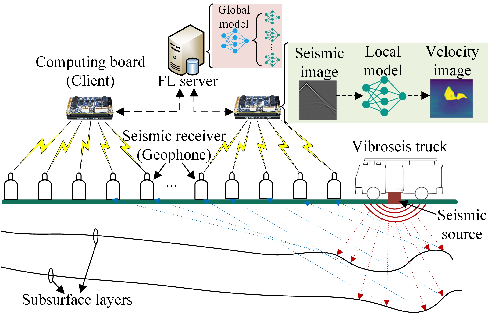
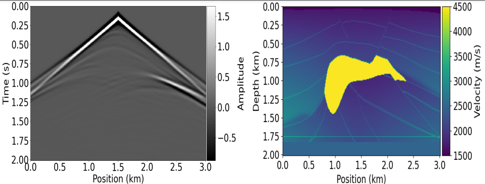

# AsyncFedInv-Asynchronous-Federated-learning-for-Seismic-Inversion

In this project, we proposed the Asynchronous Federated Learning for Seismic Inversion (AsyncFedInv) framework, which applies multiple IoT devices in terms of edge computing boards to collaboratively train a compact UNet model in real-time based on a novel asynchronous federated learning, where 1) a staleness function is applied to mitigate model staleness, and 2) clients that generate similar local models would suspend its training, thus reducing the communication costs and energy consumption.

The overview of the whole AnsycFedInv architecture is shown in the image below:

The dataset used in this work is the Salt Data which consist of the seismic data and their corresponding velocity models. The pairs are fed to the UNet model to the non-linear mapping from the seismic data to the velocity model. The seismic data specifications are $S\times R\times T$ = $29\times 301\times 201$ and velcity model specifications are $R\times T$ = $301\times 201$. The seismic and velocity model images are shown below:

The UNet is based on an encoder-decoder structure, where the encoder reduces the dimensions of the inputs by extracting relevant high-level features, and the decoder transforms the extracted features into a different domain. As shown in the figure below, the encoder has four convolutional layers with $3 × 3$ fixed kernel size and both stride and padding equal to 1. Each convolutional layer is then followed by a 2 × 2 max-pooling with the stride of 2 to downsample the feature maps. At each downsampling step, the number of feature channels is doubled. The channel dimensions in the encoding are 32, 64, 128, and 256. The decoder comprises four transposed convolutional layers for upsampling, each with $5 × 5$ kernel size, stride of $2$, and zero padding. At each upsampling step, the number of feature channels is halved. The channel dimensions in the decoding path are 512, 256, 128, 64, and 32. Finally, a $3 × 3$ convolutional layer maps the last 32 features into the predicted velocity value. 

We performed several simulations on the Salt data and the Simulation results demonstrate that AsyncFedInv achieves a similar convergence rate but lower training loss and better testing performance as compared to a baseline algorithm FedAvg in both IID and non-IID cases.
